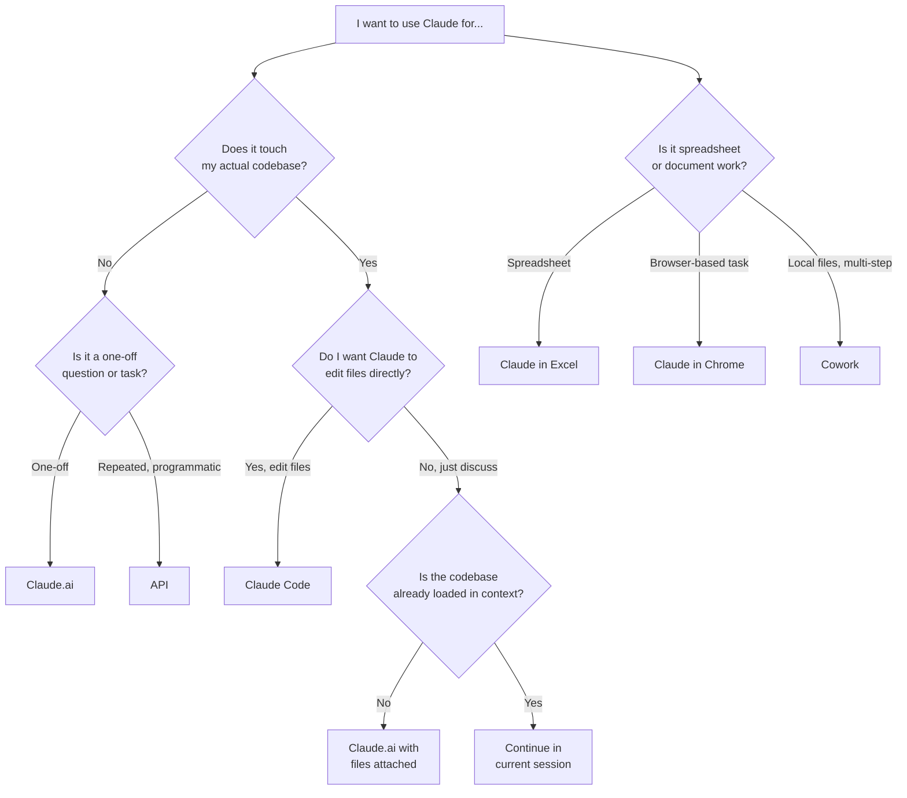

# Decision Guide: Which Claude Surface Should I Use?

The honest answer is that most engineers default to whichever Claude surface they tried first, and that's usually wrong for half their tasks. This guide is opinionated. Disagree where you have evidence.

## The 30-second flowchart

## When to use each surface

### Claude.ai (the chat interface)

**Use when:**
- You're thinking through a problem before writing any code
- You need a one-off answer, draft, or explanation
- You want artifacts (rendered HTML, diagrams, charts) inline
- You're doing research with web search
- You need to share a conversation with someone

**Don't use when:**
- You're going to make changes across many files in a real repo (use Claude Code)
- You need the same prompt run hundreds of times (use the API)
- The task requires touching local files repeatedly (Claude Code or Cowork)

**Underrated use:** the "thinking partner" mode. Open Claude.ai, paste your half-written design doc, and ask "what's wrong with this?" before you commit to building it.

### Claude Code (the CLI)

**Use when:**
- You're working in a real codebase and want Claude to read, edit, and run things
- You need agentic loops (test, fix, retest)
- You're doing refactors that span multiple files
- You want CLAUDE.md to give Claude persistent context about your project
- You need MCP integrations (database queries, ticket systems, etc.) inline with coding

**Don't use when:**
- You just want to ask a question that doesn't need codebase access
- You're exploring an idea that hasn't crystallized into "edit these files"
- You're working on something where you don't trust Claude to make changes (use chat instead)

**The most common mistake:** using Claude Code as a fancy chat. If Claude isn't reading or editing files, you're paying for capability you're not using. Open Claude.ai instead.

### The API

**Use when:**
- You're building a product that uses Claude
- You need to run the same prompt at scale (batch processing, evals, classification)
- You need fine control over caching, system prompts, or tool use
- You want to compare model versions programmatically

**Don't use when:**
- You're trying to do interactive work (any chat surface is faster)
- You just need to run a prompt twice (just run it twice in chat)

**Underrated use:** prompt caching for long context. If you're querying the same large document repeatedly, caching can drop costs by 80%+ and latency by half. Worth setting up even for a personal tool.

### Cowork (desktop file/task agent)

**Use when:**
- You're orchestrating local files across multiple steps (organize, transform, summarize)
- You're a non-developer who needs Claude to do real work on your machine
- The task is "do this whole thing for me" rather than "help me code"

**Don't use when:**
- You're an engineer working in a codebase (Claude Code is sharper)
- The task is single-shot (chat is faster)

### Claude in Chrome

**Use when:**
- The task lives entirely in a browser (research, form filling, comparison shopping)
- You want Claude to navigate sites, not just read them
- You're doing competitive analysis across many web pages

**Don't use when:**
- You can solve it with a one-off web search in Claude.ai
- The task requires authentication on sensitive accounts (you should review the trust model first)

### Claude in Excel

**Use when:**
- You're doing real spreadsheet work and want Claude to operate on cells/formulas/tabs
- You need to clean, reshape, or analyze tabular data inside Excel itself

**Don't use when:**
- The data is small enough to paste into Claude.ai (faster, more flexible)
- You'd rather have a Python script (use Claude Code with pandas)

## The tradeoffs nobody talks about

### Context window vs. cost vs. quality

Bigger context isn't free. Loading a giant codebase into every Claude Code session costs tokens and slows responses. Often a tighter CLAUDE.md plus targeted file reads beats stuffing everything in.

### Long sessions rot

After roughly 30+ turns or a saturated context window, model behavior degrades. Outputs get repetitive, suggestions get worse, instructions get forgotten. **If a session is going sideways, start a new one.** Carry forward only what matters in a brief recap.

### The model picker matters more than people think

- **Opus**: hardest reasoning, planning, novel problems, code review
- **Sonnet**: the daily driver for most coding work
- **Haiku**: fast loops, classification, anything where you'll iterate many times

Defaulting to Opus for everything wastes money. Defaulting to Haiku for everything wastes your time fixing bad output. Match the model to the task.

### Claude Code vs. chat for "just one file"

If you're editing one file and you already have it open, paste it into Claude.ai and iterate there. The Claude Code overhead (session start, file reads, permission prompts) is only worth it when the task is genuinely multi-file or agentic.

## A simple heuristic

> If the task can be expressed as "answer this question," use chat.
> If it can be expressed as "do this work in my repo," use Claude Code.
> If it's "run this prompt at scale," use the API.
> Everything else is one of the specialized surfaces.

When in doubt, start in chat. You can always escalate.
